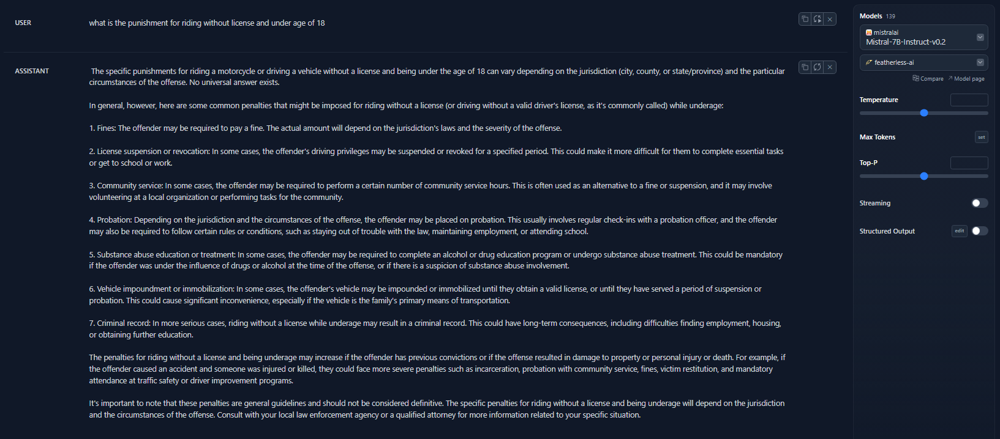
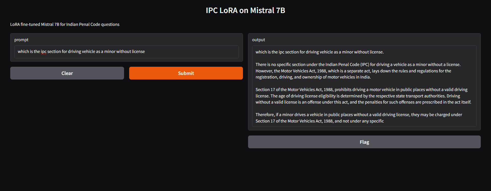

# Law GPT: A Legal Language Model Fine-Tuned on Indian Penal Code (IPC)


## 📌 Project Overview

**Law-GPT** is a transformer-based legal language model fine-tuned to assist with Indian Penal Code (IPC) queries. 
Built on top of [Mistral-7B](https://huggingface.co/TheBloke/Mistral-7B-Instruct-v0.1) using QLoRA and PEFT (Parameter-Efficient Fine-Tuning), this model helps legal professionals, students, and developers generate relevant legal explanations, suggest applicable IPC sections, and summarize offenses.


## 🔧 How to Use

### 🔗 Hugging Face Inference API (Web)

You can try the model directly via the 🤗 [Hosted Space](https://huggingface.co/spaces/arjun-ms/mistral-lora-ipc).

```python
from transformers import AutoModelForCausalLM, AutoTokenizer
import torch

model_name = "arjun-ms/mistral-lora-ipc"

tokenizer = AutoTokenizer.from_pretrained(model_name)
model = AutoModelForCausalLM.from_pretrained(
    model_name,
    torch_dtype=torch.float16,
    device_map="auto"
)

input_text = "A person forcibly entered someone's house at night with intent to harm. Which IPC sections may apply?"

inputs = tokenizer(input_text, return_tensors="pt").to("cuda")
outputs = model.generate(**inputs, max_new_tokens=200)
print(tokenizer.decode(outputs[0], skip_special_tokens=True))
```

> ✅ **Note**: This model supports instruction-style prompts like:
>
>   * `"Explain the punishment under IPC section 376"`
>   * `"Suggest IPC sections for a case involving theft and trespassing"`

-----

## 📊 Fine-Tuning Summary

### 📁 Base Model

  * **Model**: Mistral-7B-Instruct-v0.2
  * **Training Method**: QLoRA using bitsandbytes (4-bit quantization)
  * **Frameworks**: Hugging Face Transformers, PEFT, HuggingFace Datasets

### 🧪 Dataset

  * **Format**: PDF
  * **Source**: Indian Penal Code Official Document

-----

### ⚖️ Before vs. After Comparison


### Before


### After



## 💼 Use Cases

  * 🧑‍⚖️ **Legal Chatbots**: Integrate into legal assistants for real-time IPC section suggestions.
  * 📚 **Legal Education**: Aid law students in understanding the structure and application of the IPC.
  * 📂 **Case Drafting Tools**: Auto-suggest IPC sections in document preparation.


## 📍 Limitations & Warnings

  * This model is not a substitute for professional legal advice.
  * It may hallucinate or misinterpret complex legal context.
  * Please validate all outputs with a legal expert before use in practice.


## 📬 Contact

For questions, feedback, or collaboration:

  * 🔗 [arjun-ms.snapcv.me](https://arjun-ms.snapcv.me)
